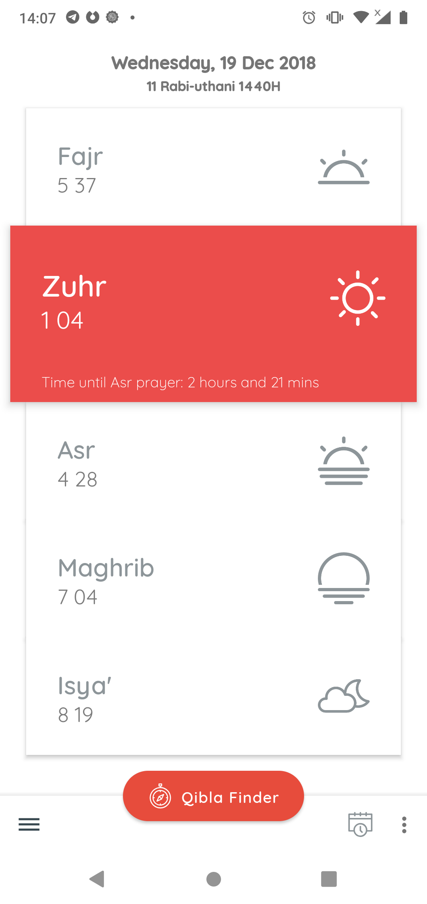
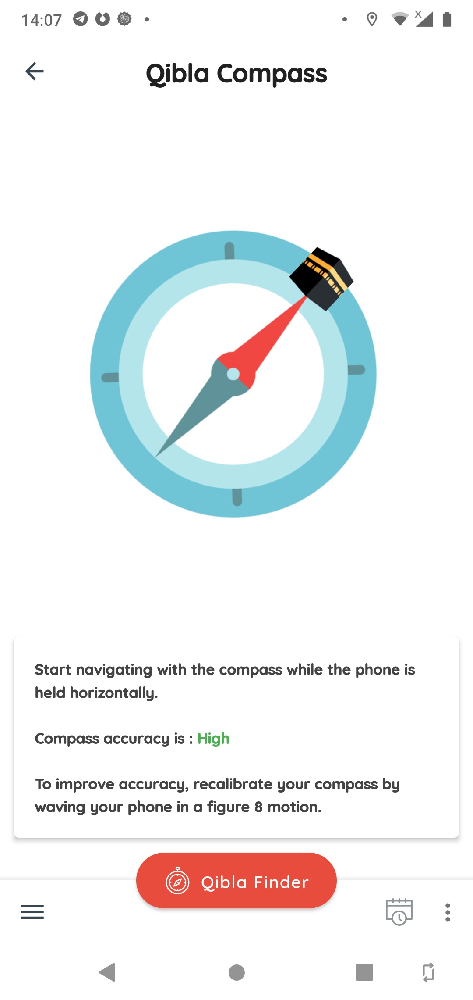
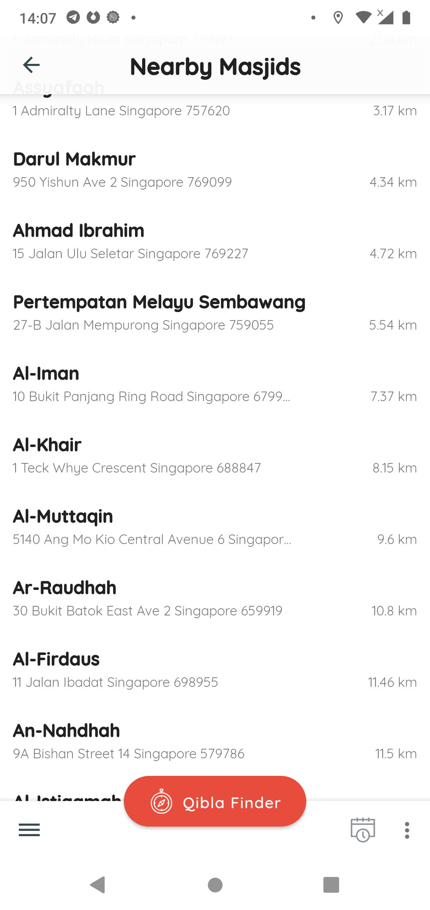
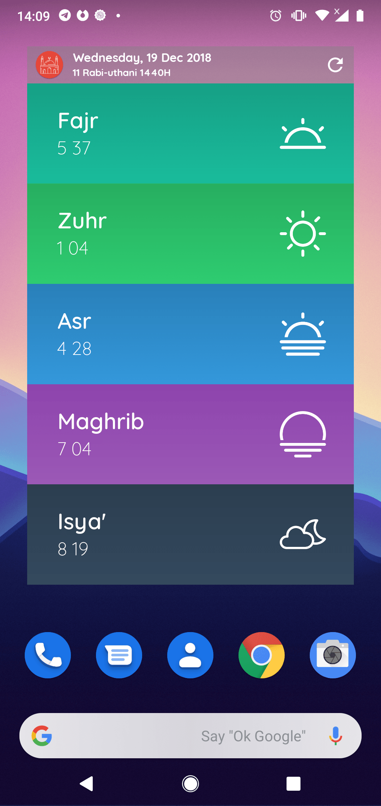

# Singapore Prayer Times App
An app for locating nearby mosques and tracking prayer times in the wonderful city of Singapore!
<br>


<a href="https://play.google.com/store/apps/details?id=com.nibmz7gmail.sgprayertimemusollah">
</a>

I will write about my journey in learning how to assemble this app. Coming from a non-coding background—well almost*, I thought it would be fun to share about the ways I approach learning, the mistakes I’ve made and what I’ve learned in the process of achieving that very goal of: Getting to know how to code and then putting it into practice. 
 
*I’ve had some classes in school but they were only introductory and didn't last. I’d say what got me ahead were mostly online tutorials, youtube videos and also CS50’s “Intro to compSci” course which I have yet to complete.  

## Credits
[Icons by Freepik from flaticon](https://www.flaticon.com/), <br>
[Android Open Source Project (AOSP)](https://source.android.com/), <br>
[iosched app](https://github.com/google/iosched), <br>
And many other libraries!

# License
```
Copyright (C) 2018 James Bond 

Licensed under the Apache License, Version 2.0 (the "License");
you may not use this file except in compliance with the License.
You may obtain a copy of the License at

http://www.apache.org/licenses/LICENSE-2.0

Unless required by applicable law or agreed to in writing, software
distributed under the License is distributed on an "AS IS" BASIS,
WITHOUT WARRANTIES OR CONDITIONS OF ANY KIND, either express or implied.
See the License for the specific language governing permissions and
limitations under the License.
```


